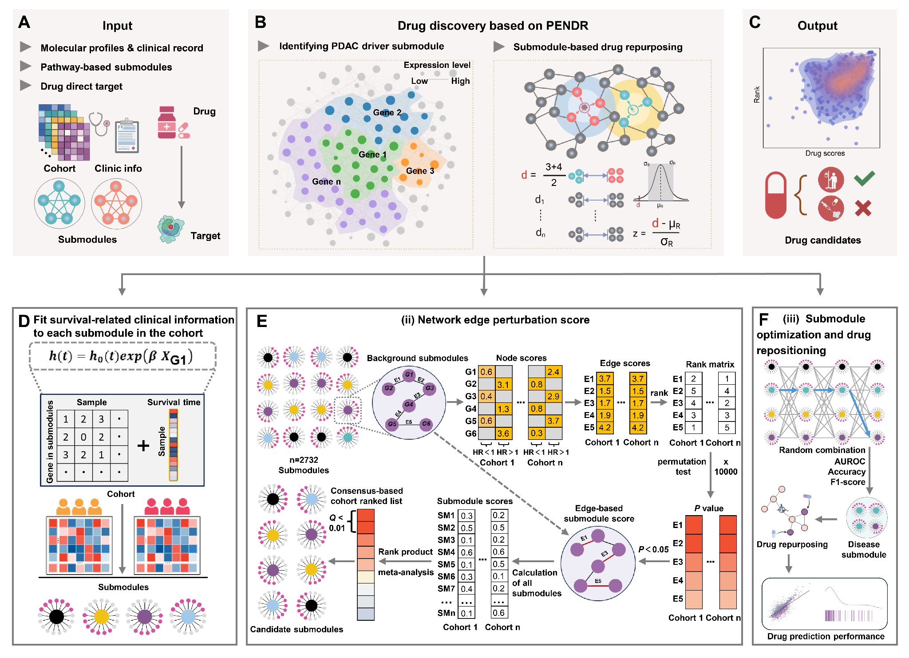

# PENDR

PENDR is a pathway-guided edge-perturbation framework for identifying
survival-associated driver submodules and prioritizing drug candidates in
pancreatic ductal adenocarcinoma (PDAC).

This repository contains the analysis code, pathway-guided submodules,
processed expression and survival data for three PDAC cohorts, example
optimization data, and a standalone network-proximity script for
submodule-based drug repurposing.

## Workflow overview

<p align="center">
  
</p>

## Analysis workflow

The repository supports the following stages:

1. Fit Cox proportional hazards models for interacting gene pairs in
   CPTAC-PDAC, TCGA-PDAC, and ICGC-PDAC-CA.
2. Calculate node-normalized, edge-based scores for 2,732 precomputed
   pathway-guided submodules.
3. Perform rank product meta-analysis across the three cohorts using 10,000
   permutations and Benjamini-Hochberg correction.
4. Exhaustively evaluate all nonempty combinations of up to 15 prioritized
   submodules using PDAC tumor-versus-normal expression data.
5. Prioritize drug candidates by network proximity between FDA drug targets
   and PDAC driver submodules using 1,000 degree-matched randomizations.

The repository starts from precomputed pathway-guided submodules. It does not
include code for constructing the consolidated human interactome, parsing
pathway GMT files, applying Walktrap community detection, or removing
overlapping submodules.

## Repository structure

```text
PENDR/
├── config.R
├── run_pipeline.R
├── R/                              # data-loading, model, and utility functions
├── scripts/
│   ├── validate_inputs.R
│   ├── 01_survival_associated_edge_scores.R
│   ├── 02_rank_product_meta_analysis.R
│   ├── 03_exhaustive_combinatorial_optimization.R
│   └── 04_Submodule-based drug repurposing.py
├── data/
│   ├── pathway_guided_submodules.txt
│   ├── pathway_guided_submodules.example.txt
│   ├── datasets/
│   │   ├── datasets.txt
│   │   ├── Pancreatic ductal adenocarcinoma1/
│   │   ├── Pancreatic ductal adenocarcinoma2/
│   │   └── Pancreatic ductal adenocarcinoma3/
│   ├── optimization/
│   │   ├── pdac_discrimination_expression.tsv
│   │   └── pdac_discrimination_samples.tsv
│   ├── FDAdurg.txt
│   ├── HumanInteractome2022.adj
│   ├── examples/
│   └── README.md
├── testdata/
│   ├── datasets.txt
│   ├── Pancreatic ductal adenocarcinoma1/
│   ├── Pancreatic ductal adenocarcinoma2/
│   └── Pancreatic ductal adenocarcinoma3/
├── results/
│   ├── cohort_submodule_scores/
│   └── rank_product_meta_analysis/
└── tests/                          # function-level validation tests
```

## Included data and current status

| Path | Status and purpose |
| --- | --- |
| `data/pathway_guided_submodules.txt` | Included; contains 2,732 pathway-guided submodules |
| `data/datasets/` | Included; contains processed expression and survival data for three PDAC cohorts |
| `testdata/` | Included demonstration data used by the current default configuration |
| `data/optimization/` | Included format-level demonstration data, not the full tumor-versus-normal optimization dataset |
| `results/cohort_submodule_scores/` | Included smoke-test outputs generated from demonstration data |
| `results/rank_product_meta_analysis/` | Included smoke-test outputs generated from demonstration data |
| `data/FDAdurg.txt` | Included FDA drug-to-target mapping table |
| `data/HumanInteractome2022.adj` | Included human interactome adjacency list |
| `data/HumanInteractome2022.npy` | Not included; required by the drug-repurposing script |
| `data/PDAC driver submodules.txt` | Not included; required by the drug-repurposing script |

The small files under `testdata/`, `data/optimization/`, and the currently
included `results/` directory are intended only to verify pipeline wiring.
They do not represent the final scientific analysis.

## Cohort data

The processed cohort data are located under `data/datasets/`:

| Dataset directory | Cohort used in the manuscript | Expression samples |
| --- | --- | ---: |
| `Pancreatic ductal adenocarcinoma1` | CPTAC-PDAC | 135 |
| `Pancreatic ductal adenocarcinoma2` | TCGA-PDAC | 93 |
| `Pancreatic ductal adenocarcinoma3` | ICGC-PDAC-CA | 193 |

Each cohort directory contains:

```text
patient_annotation.txt
mRNA_abundance.txt
```

The expression matrices contain Entrez identifiers with the `_at` suffix as
row names and samples as columns. The annotation files contain the sample
identifier, tumor status, survival time, survival status, and survival-time
unit.

### Important configuration note

The current `config.R` sets:

```r
cohort_data_directory = "testdata"
```

Therefore, the default R commands use the demonstration data under
`testdata/`, not the processed cohort data under `data/datasets/`.

To run the R analysis with the included processed cohorts, set
`cohort_data_directory` to `data/datasets`. The corresponding manifest must
also contain the column name `annotation`, because the current validation and
loading functions expect the singular form. The manifest currently stored at
`data/datasets/datasets.txt` uses `annotations` and must be reconciled before
it can be used by the R pipeline.

The cohort mapping in `config.R` should remain:

```text
Pancreatic ductal adenocarcinoma1 -> CPTAC-PDAC
Pancreatic ductal adenocarcinoma2 -> TCGA-PDAC
Pancreatic ductal adenocarcinoma3 -> ICGC-PDAC-CA
```

## Statistical definition of the edge score

The repository provides local implementations of the three functions required
by the edge-focused analysis, so no additional specialized R package is
needed:

- `load.cancer.datasets()`
- `fit.interaction.model()`
- `get.adjacency.matrix()`

For each cohort, expression of both genes in an interacting pair is
median-dichotomized. The interaction term follows the concordance/XNOR
definition: it equals 1 when the two genes are assigned to the same expression
group and 0 when they are assigned to different groups.

A multivariable Cox model is fitted with the two individual expression groups
and their concordance/XNOR term. For an edge with interaction
`P < 0.05`, `abs(log2(HR))` contributes to the submodule score. The sum of the
eligible edge contributions is divided by the number of nodes in the
submodule.

The interaction P value used at this stage is the Cox-model P value. The
10,000 permutations are applied later during rank product meta-analysis.

## Software requirements

### R analysis

- R 4.4 or later
- CRAN packages: `survival`, `pROC`
- Bioconductor packages: `AnnotationDbi`, `org.Hs.eg.db`

```r
install.packages(c("survival", "pROC"))

if (!requireNamespace("BiocManager", quietly = TRUE)) {
  install.packages("BiocManager")
}

BiocManager::install(c("AnnotationDbi", "org.Hs.eg.db"))
```

### Drug-repurposing analysis

- Python 3
- `numpy`
- `networkx`

```bash
python -m pip install numpy networkx
```

## Run the R analysis

Run all R commands from the repository root.

Validate all inputs configured in `config.R`:

```bash
Rscript run_pipeline.R validate
```

Calculate cohort-specific survival-associated edge and submodule scores:

```bash
Rscript run_pipeline.R score CPTAC-PDAC
Rscript run_pipeline.R score TCGA-PDAC
Rscript run_pipeline.R score ICGC-PDAC-CA
```

Perform rank product meta-analysis:

```bash
Rscript run_pipeline.R meta-analysis
```

Evaluate all nonempty combinations of the prioritized submodules:

```bash
Rscript run_pipeline.R optimize
```

Run all R stages:

```bash
Rscript run_pipeline.R all
```

The input validator checks the pathway-guided submodules, cohort manifest,
cohort files, and optimization data in one run. Consequently, `validate` and
`all` require both the cohort inputs and the tumor-versus-normal optimization
inputs to be available at the paths specified in `config.R`.

## Tumor-versus-normal optimization input

The optimization stage reads:

```text
data/optimization/pdac_discrimination_expression.tsv
data/optimization/pdac_discrimination_samples.tsv
```

The expression file must contain HGNC gene symbols in the first column,
followed by normalized expression values for tumor and normal samples:

```text
gene_symbol    sample_001    sample_002
TP53           5.821         3.217
```

The sample metadata file must contain:

```text
sample_id    class
sample_001   Tumor
sample_002   Normal
```

Class labels must be exactly `Tumor` and `Normal`. The files currently present
under `data/optimization/` contain only three genes and four samples and are
format examples. Replace them with the complete discrimination dataset before
performing the scientific optimization analysis.

For up to 15 candidate submodules, the script evaluates every nonempty
combination. Fifteen candidates produce 32,767 combinations. Each combination
is evaluated using AUROC, accuracy, and F1 score, and the three metric ranks
are combined using their geometric mean.

## Run the drug-repurposing analysis

The drug-repurposing analysis is implemented as a standalone Python script and
is not called by `run_pipeline.R`:

```text
scripts/04_Submodule-based drug repurposing.py
```

The script expects the following files in its current working directory:

| File | Required format |
| --- | --- |
| `FDAdurg.txt` | Two columns: DrugBank drug identifier and Entrez target identifier |
| `HumanInteractome2022.adj` | NetworkX-compatible adjacency list with Entrez identifiers |
| `HumanInteractome2022.npy` | All-pairs shortest-path distance matrix ordered consistently with the sorted interactome nodes |
| `PDAC driver submodules.txt` | Two columns: driver-submodule identifier and Entrez gene identifier |

`FDAdurg.txt` and `HumanInteractome2022.adj` are provided under `data/`.
`HumanInteractome2022.npy` and `PDAC driver submodules.txt` must be prepared
before running this stage.

The driver-submodule input must contain one submodule-gene association per
line, for example:

```text
PDAC_driver_submodule_1    7157
PDAC_driver_submodule_1    1956
PDAC_driver_submodule_2    5290
```

The Python script matches identifiers directly against the interactome.
Therefore, the second column must contain Entrez identifiers rather than HGNC
symbols. The gene-symbol output from the R optimization stage is not directly
interchangeable with this input without identifier conversion and assignment
of genes to their respective submodules.

After placing all four required files under `data/`, run:

```bash
cd data
python "../scripts/04_Submodule-based drug repurposing.py"
```

The script uses the `CLOSEST` network-proximity measure and generates 1,000
degree-matched random pairs with seed 1024. It writes:

```text
Drug candidate prediction.txt
```

with the columns:

```text
Source    Target    Distance    Z_score    P_value
```

## Main outputs

### Edge and meta-analysis outputs

```text
results/cohort_submodule_scores/
results/rank_product_meta_analysis/submodule_by_cohort_score_matrix.tsv
results/rank_product_meta_analysis/rank_product_meta_analysis_results.tsv
```

### Exhaustive optimization outputs

```text
results/exhaustive_combinatorial_optimization/
├── submodule_combination_metrics.tsv
├── submodule_combination_metrics.rds
├── optimized_pdac_driver_submodules.txt
└── optimized_pdac_driver_genes.txt
```

### Drug-repurposing output

```text
data/Drug candidate prediction.txt
```

when the Python script is run from the `data/` directory as shown above.

## Reproducibility

- Cohort names, thresholds, input paths, and random settings for the R
  analysis are centralized in `config.R`.
- The edge inclusion threshold is the Cox interaction `P < 0.05`.
- Significant submodules are selected at adjusted `Q < 0.01`.
- Rank product significance is estimated using 10,000 permutations with
  random seed 2026.
- At most 15 candidate submodules are included in exhaustive combinatorial
  optimization.
- Drug network proximity uses 1,000 degree-matched randomizations with seed
  1024.
- The included result files are smoke-test outputs and must not be interpreted
  as study results.

Before publishing this repository or redistributing its data, verify the access
and redistribution terms of CPTAC, TCGA, ICGC, DrugBank, and all pathway and
interaction databases. Add a license approved by all code and data owners
before making the repository public.
